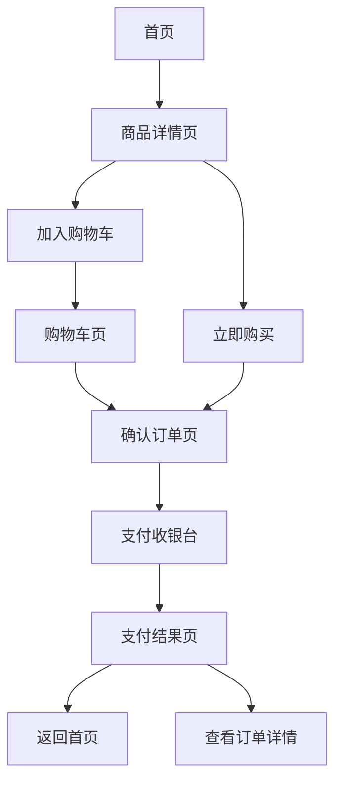

# 健康商城APP产品需求文档

## 1. 产品概述

健康商城APP是一款专注于健康产品销售的移动应用，旨在为用户提供便捷的健康产品购买体验。
- 该产品主要解决用户购买健康产品的需求，包括维生素、蛋白粉、鱼油、钙片等健康补充剂。
- 产品目标是成为用户信赖的健康产品购物平台，提供高品质的产品和优质的服务。

## 2. 核心功能

### 2.1 功能模块

我们的健康商城APP包含以下主要页面：
1. 首页：搜索框、导航栏、顶部banner、服务金刚位、商品瀑布流
2. 商品详情页：商品主图、商品名称、商品信息、店铺信息、优惠券信息
3. 购物车页：商品列表、数量调整、删除商品、结算功能
4. 确认订单页：收货地址选择、商品清单、配送方式、支付方式选择
5. 支付收银台：支付金额、支付方式选择、支付倒计时
6. 支付结果页：支付成功/失败状态、订单信息、跳转功能

### 2.2 页面详情

| 页面名称 | 模块名称 | 功能描述 |
|---------|---------|----------|
| 首页 | 搜索框 | 支持关键词搜索商品，驻顶显示 |
| 首页 | 导航栏 | 包含首页、分类、关于我们、联系我们等导航项 |
| 首页 | 顶部banner | 展示促销活动、新品推荐等信息，支持轮播 |
| 首页 | 服务金刚位 | 快捷入口，包含维生素、蛋白粉、鱼油、钙片等分类 |
| 首页 | 商品瀑布流 | 展示热门商品，支持滚动加载更多 |
| 商品详情页 | 商品主图 | 展示商品高清图片，支持图片轮播 |
| 商品详情页 | 商品名称 | 显示商品名称和价格 |
| 商品详情页 | 商品信息 | 展示商品描述、规格、成分等详细信息 |
| 商品详情页 | 店铺信息 | 显示店铺名称、评分等信息 |
| 商品详情页 | 优惠券信息 | 展示可用优惠券，支持领取 |
| 购物车页 | 商品列表 | 显示已添加到购物车的商品 |
| 购物车页 | 数量调整 | 支持增加/减少商品数量 |
| 购物车页 | 删除商品 | 支持删除购物车中的商品 |
| 购物车页 | 结算功能 | 计算总价并跳转到确认订单页 |
| 确认订单页 | 收货地址选择 | 显示默认地址，支持选择其他地址或添加新地址 |
| 确认订单页 | 商品清单 | 显示订单商品详情和数量 |
| 确认订单页 | 配送方式 | 选择配送方式，显示运费 |
| 确认订单页 | 支付方式选择 | 支持微信支付、支付宝等支付方式 |
| 支付收银台 | 支付金额 | 显示订单总金额 |
| 支付收银台 | 支付方式选择 | 支持微信、支付宝两种支付方式 |
| 支付收银台 | 支付倒计时 | 显示支付剩余时间，超时自动取消订单 |
| 支付结果页 | 支付状态 | 显示支付成功或失败状态 |
| 支付结果页 | 订单信息 | 显示订单编号、支付金额、支付时间等信息 |
| 支付结果页 | 跳转功能 | 支持返回首页或查看订单详情 |

## 3. 核心流程

用户购买商品的主要流程如下：

1. 用户进入首页，浏览商品或使用搜索功能查找特定商品
2. 用户点击商品进入商品详情页，查看商品信息
3. 用户选择商品数量，点击"加入购物车"或"立即购买"
4. 如果选择"加入购物车"，商品会被添加到购物车，用户可以继续购物
5. 用户进入购物车页，确认商品信息和数量，点击"去结算"
6. 用户进入确认订单页，选择收货地址、配送方式和支付方式，点击"提交订单"
7. 用户进入支付收银台，选择支付方式并完成支付
8. 支付成功后，用户会看到支付成功页面，可选择返回首页或查看订单详情



## 4. 用户界面设计

### 4.1 设计风格

- 主色调：橙色系（#FF6B00），代表健康、活力
- 辅助色：白色（#FFFFFF）、浅灰色（#F5F5F5）、深灰色（#333333）
- 按钮风格：圆角矩形，有轻微的阴影效果
- 字体：无衬线字体，清晰易读
- 布局风格：卡片式布局，信息层次分明
- 图标风格：线性图标，简洁现代

### 4.2 页面设计概览

| 页面名称 | 模块名称 | UI元素 |
|---------|---------|--------|
| 首页 | 搜索框 | 圆角矩形输入框，位于顶部，背景为浅灰色，右侧有搜索图标 |
| 首页 | 导航栏 | 白色背景，黑色文字，选中状态为橙色 |
| 首页 | 顶部banner | 轮播图，高度约为屏幕高度的1/3，有渐变蒙版和文字叠加 |
| 首页 | 服务金刚位 | 网格布局，每个入口包含图标和文字，图标背景为对应颜色的浅色调 |
| 首页 | 商品瀑布流 | 两列网格布局，每个商品卡片包含图片、名称和价格，有轻微的阴影效果 |
| 商品详情页 | 商品主图 | 大图展示，支持左右滑动切换图片 |
| 商品详情页 | 商品信息 | 白色背景，黑色文字，价格为橙色，字体较大 |
| 商品详情页 | 底部操作栏 | 固定在底部，包含加入购物车和立即购买按钮 |
| 购物车页 | 商品列表 | 每个商品项包含图片、名称、价格、数量调整控件和删除按钮 |
| 购物车页 | 底部结算栏 | 固定在底部，显示总价和结算按钮 |
| 确认订单页 | 地址选择 | 卡片式布局，选中状态有边框高亮 |
| 确认订单页 | 支付方式 | 列表式布局，每个选项包含图标和文字，选中状态有对勾标记 |
| 支付收银台 | 支付方式 | 大按钮式布局，选中状态有边框和背景色变化 |
| 支付收银台 | 二维码 | 居中显示，有背景框和文字说明 |
| 支付结果页 | 状态图标 | 大尺寸图标，成功为绿色，失败为红色 |
| 支付结果页 | 操作按钮 | 两个按钮并排，主按钮为橙色，次要按钮为白色边框 |

### 4.3 响应式设计

- 设计以移动设备为主，支持320px-414px的屏幕宽度
- 针对不同屏幕尺寸，调整布局和字体大小
- 在平板设备上，可适当调整为多列布局，提高信息密度

## 5. 技术实现

### 5.1 前端技术

- 框架：React
- 语言：TypeScript
- 路由：React Router
- 样式：Tailwind CSS
- 构建工具：Vite
- 状态管理：React useState
- 图片处理：使用第三方API生成图片

### 5.2 页面结构

```
/src
  /components
    Header.tsx        // 头部导航栏
    Footer.tsx        // 底部导航栏
  /pages
    Home.tsx          // 首页
    ProductDetail.tsx // 商品详情页
    Cart.tsx          // 购物车页
    Checkout.tsx      // 确认订单页
    Payment.tsx       // 支付收银台
    PaymentSuccess.tsx // 支付结果页
  App.tsx            // 应用主组件
  main.tsx           // 应用入口
```

### 5.3 关键功能实现

1. **商品搜索**：使用React状态管理实现搜索框输入和搜索逻辑
2. **购物车管理**：使用React状态管理实现商品的添加、删除和数量调整
3. **支付流程**：实现从确认订单到支付成功的完整流程
4. **响应式布局**：使用Tailwind CSS的响应式类实现不同屏幕尺寸的适配

## 6. 数据需求

### 6.1 数据模型

1. **商品数据**
   - id: 商品ID
   - name: 商品名称
   - price: 价格
   - image: 商品图片
   - description: 商品描述
   - details: 商品详情
   - stock: 库存

2. **购物车数据**
   - id: 购物车项ID
   - productId: 商品ID
   - quantity: 数量
   - price: 单价

3. **订单数据**
   - id: 订单ID
   - items: 订单商品列表
   - totalPrice: 总价格
   - status: 订单状态
   - createTime: 创建时间
   - paymentTime: 支付时间

4. **用户数据**
   - id: 用户ID
   - name: 用户名
   - phone: 手机号
   - addresses: 收货地址列表

### 6.2 数据接口

1. **商品相关接口**
   - GET /api/products: 获取商品列表
   - GET /api/products/{id}: 获取商品详情

2. **购物车相关接口**
   - GET /api/cart: 获取购物车列表
   - POST /api/cart: 添加商品到购物车
   - PUT /api/cart/{id}: 更新购物车商品数量
   - DELETE /api/cart/{id}: 删除购物车商品

3. **订单相关接口**
   - POST /api/orders: 创建订单
   - GET /api/orders/{id}: 获取订单详情
   - PUT /api/orders/{id}/pay: 支付订单

4. **用户相关接口**
   - GET /api/users/addresses: 获取用户地址列表
   - POST /api/users/addresses: 添加用户地址

## 7. 测试计划

### 7.1 功能测试

- 测试首页各模块的显示和功能
- 测试商品详情页的信息展示和操作
- 测试购物车的添加、删除、数量调整功能
- 测试订单流程的完整性
- 测试支付流程的正确性

### 7.2 兼容性测试

- 测试在不同移动设备上的显示效果
- 测试在不同浏览器上的兼容性
- 测试在不同网络环境下的加载速度

### 7.3 性能测试

- 测试首页的加载速度
- 测试商品列表的滚动流畅度
- 测试购物车和订单页面的响应速度

## 8. 上线计划

### 8.1 上线前准备

- 完成所有功能的开发和测试
- 准备上线所需的图片和文案
- 配置服务器和数据库
- 进行安全测试和性能优化

### 8.2 上线流程

1. 发布测试版本，进行内部测试
2. 收集测试反馈，进行bug修复
3. 发布正式版本到应用商店
4. 监控上线后的运行状态
5. 收集用户反馈，持续优化

### 8.3 运营计划

- 制定上线初期的促销活动
- 开展用户推广活动
- 定期更新商品和内容
- 建立用户反馈渠道，及时响应用户需求

## 9. 风险评估

### 9.1 技术风险

- 前端性能问题：页面加载速度慢，影响用户体验
- 兼容性问题：在某些设备或浏览器上显示异常
- 数据安全问题：用户信息和支付信息的安全

### 9.2 业务风险

- 商品库存管理：库存不足导致用户无法购买
- 支付失败：支付过程中出现异常，影响用户体验
- 物流配送：配送延迟或丢失，影响用户满意度

### 9.3 应对措施

- 技术风险：优化代码，使用CDN加速，加强安全措施
- 业务风险：建立完善的库存管理系统，与支付平台紧密合作，选择可靠的物流合作伙伴

## 10. 总结

健康商城APP是一款专注于健康产品销售的移动应用，通过提供便捷的购物体验和优质的产品，满足用户对健康产品的需求。本产品需求文档详细描述了产品的功能、流程、界面设计和技术实现，为开发团队提供了明确的指导。

在开发过程中，我们将注重用户体验，确保应用的稳定性和安全性，同时不断优化和完善功能，为用户提供更好的服务。